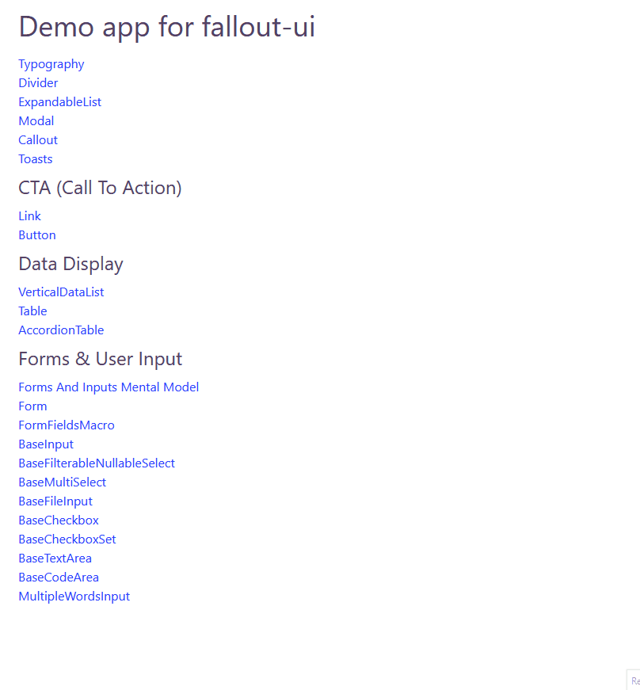

# fallout-ui

Reference component library made for `Yew.rs`, using only `tailwind` and `notifier.js`.

Features:

- A custom form state management solution called `FormFields` similar to `useForm` in react ecosystem
- Colors, fonts and other configuration available via `./fallout-ui/tailwind.config.js`
- Components:
  - Modal
  - Table
  - Accordion table
  - Various input components that go well with the `FormFields` macro
  - Button
  - Link
  - Callout
  - Expandable list
  - Toast
  - Vertical data list
- Few utility hooks



## Running this project

Install trunk:

```
cargo install trunk
```

Go to the demo app:

```
cd ./demo-app
```

Serve the app:

```
trunk serve
```

## History

This is a part of a bigger project I've been running in production for quite a while now.
But I've always felt guilty to keep this component library part of the project in the dark.
So I've given it some effort and decoupled it, to open source and give back to the community.

## Contributing

Unfortunately I have neither will or time to maintain a component library.
So copy, reference and fork away, but no issues or pull requests will be addressed.
